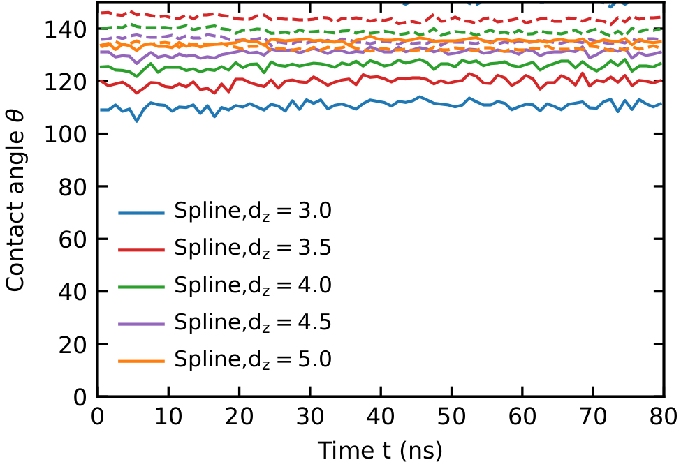
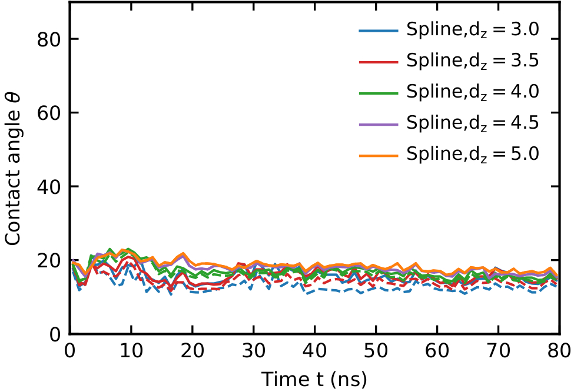
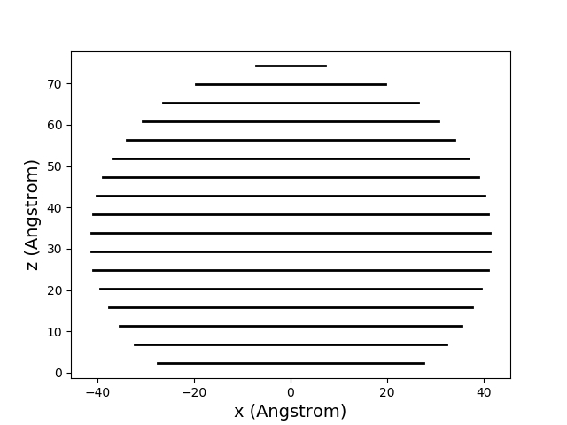
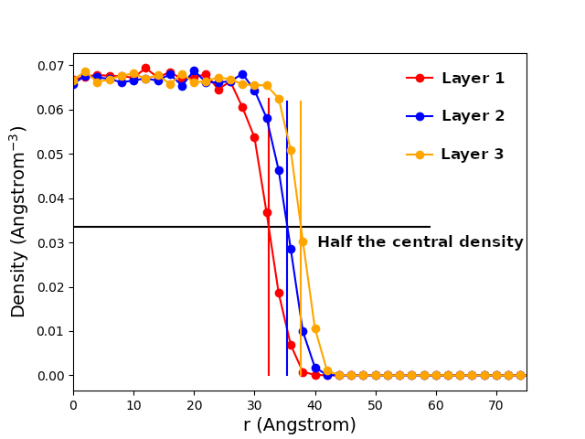
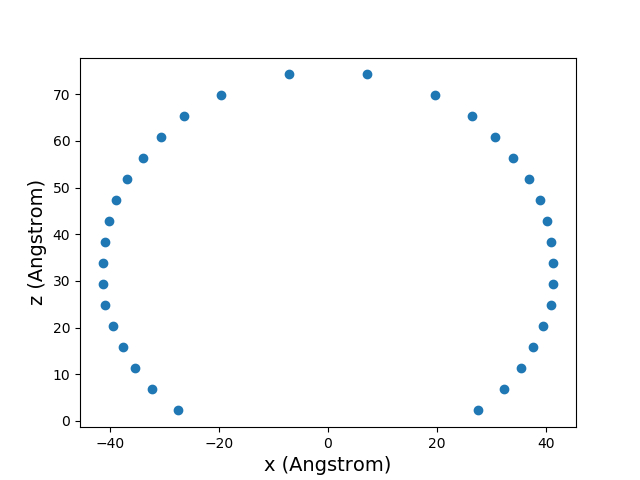

# Contact Angle Analyzer for Molecular Simulations

 

The calculated contact angle is shown against time. Solid lines are values from spline fits and dashed lines from linear fits.

## Technology Highlights:

SessileDropContactAngle is a Python-based project developed for the robust calculation of the contact angle of a sessile droplet in molecular dynamics (MD) simulations. 
This tool is built on top of several prominent libraries:

 - MDAnalysis for analyzing and manipulating molecular dynamics simulations,
 - NumPy for efficient numerical computations,
 - SciPy for advanced mathematical functions and algorithms, including spline and linear fitting methods.

This tool provides an automatic, precise and readable approach to determine the contact angle, a critical parameter in the study of numerous physical and chemical processes like wetting, adsorption, and surface tension phenomena.

### If you use SessileDropContactAngle in your work, please cite the following paper:

Materzok, T.; Canestraight, A.; Gorb, S.; Müller-Plathe, F. ["How Does Gecko Keratin Stick to Hydrophilic and Hydrophobic Surfaces in the Presence and Absence of Water? An Atomistic Molecular Dynamics Investigation"](https://doi.org/10.1021/acsnano.2c08627). ACS Nano 2022, 16 (11), 19261–19270.


## Overview

### contact_angle_calculator.py

This Python script calculates the contact angle of a sessile droplet from molecular dynamics simulations. The tool goes through the following steps:

 - Reading the topology and trajectory files of the MD simulation: Containing the spatial and temporal data for the atoms in the simulation.

 - Selecting the water atoms within the droplet: The script identifies the water atoms via the SPC/E type "OW"

 - Calculating the z-density and central density of the sessile droplet: The droplet is divided into layers using a bin width of 0.2 nm. The average number density of water in the center of the droplet is then calculated.

 

 - Identifying the water-air interface: First, the tool computes a average radial density histogram for a group of frames, to smooth out fluctuations and improve accuracy. For each window, it determines where the radial density equals half of the droplet's interior density. This is the point where the water molecules in the droplet interface with the air, also referred to as the "edge" of the droplet. The calculation is achieved by linear interpolation between the radial densities for each z-layer. This process is repeated for each averaging window (50 frames) throughout the trajectory.

   

 - Computing the contact angle using linear extrapolation and spline fitting methods: Both linear and spline fitting methods are applied to the identified water-air interface coordinates. The contact angle is calculated as the arc-tangent of the slope of the fitted curve. This process is repeated for each averaging window in the trajectory, providing a time series of the contact angle. Averaging over multiple frames in this manner allows for more reliable and statistically significant contact angle values, reducing the impact of transient fluctuations in the data.

 - For linear fitting, the calculation involves a simple two-point linear interpolation based on the radial positions of the water-air interface.

 - For spline fitting, the calculation is a bit more complex. It involves selecting the relevant interface coordinates and fitting parameters based on the droplet shape (convex or concave; hydrophilic or hydrophobic). A spline is then fit to these coordinates, and the contact angle is calculated based on the derivative of the spline at the origin.

 - Outputting the linear and spline contact angles: After calculating and saving the contact angles as a time series, the script calculates the mean contact angle for both the linear and spline fitting methods.


### Inputs

The script accepts several command-line arguments

 - -f : Input XTC trajectory file (default='run_hydrophilic_production_layer.xtc')
 - -s : Input TPR topology file (default='run_hydrophilic_production_layer.tpr')
 - -o : Output file prefix (default='zbin')
 - -o2 : Output file prefix and type of surface (default='hydrophilic')
 - -bin : Bin width for z-axis (in Angstrom, default=4.0)
 - -b : First frame to analyze (default=0)
 - -e : Last frame to analyze (default=-1, meaning it will analyze until the last frame)
 - -s : Number of frames to step_interval between analyses (default=1, analyze every frame)

### Outputs

The script produces two output files:

 - Contact angles calculated with linear extrapolation (.xvg file)
 - Contact angles calculated with spline fitting (.xvg file)

### Dependencies

 - Python 3.x
 - MDAnalysis
 - Numpy
 - Scipy

### Usage

 1. Ensure that you have the required Python packages installed:

```
pip install numpy MDAnalysis scipy
```

 2. Clone this repository to your local machine using:

```
git clone https://github.com/TobiasMaterzok/SessileDropContactAngle.git
```

Make sure to replace <your_username> with your actual GitHub username.

 3. Navigate to the directory where the script is located:

```
cd SessileDropContactAngle
```

 4. Run the script using the command:

```
python contact_angle_calculator.py -f hydrophilic.xtc -s hydrophilic.tpr -o zbin -o2 hydrophilic -bin 2.0 -b 0 -e -1 -s 1
```

Note: This script may take some time to run, depending on the input parameters.
License

This project is licensed under the MIT License - see the LICENSE file for details.
